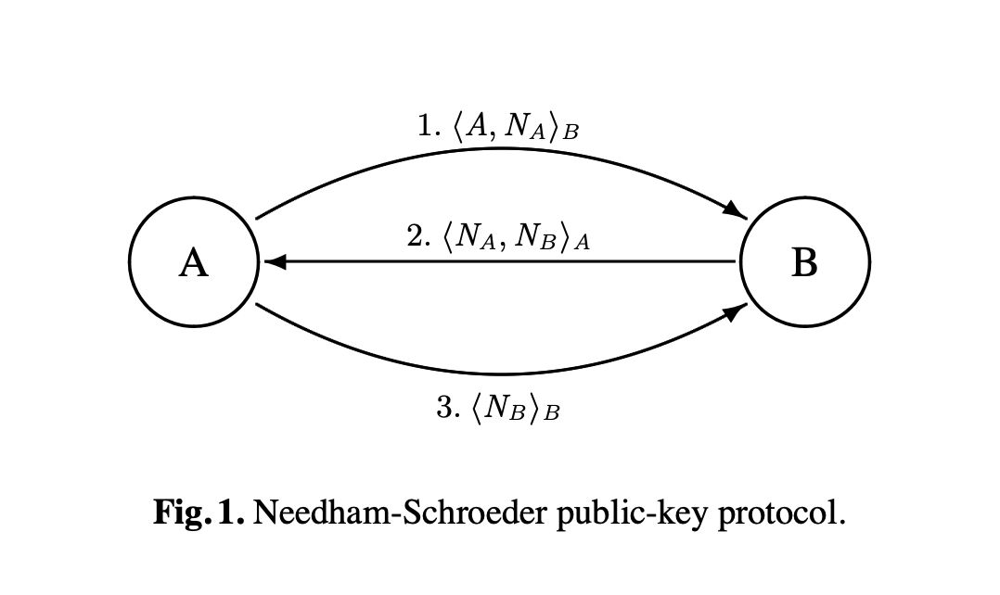
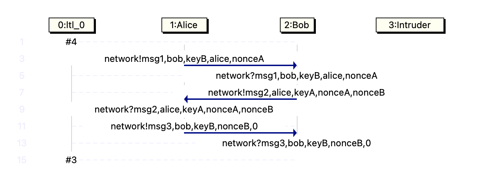

# Model Checking with Spin - Tutorial 2 (Needham-Schroeder)

This lecture is based on Section 2 of the article (which is required background for this write-up)

- Stephan Merz (2001). [Model Checking: A Tutorial Overview](https://members.loria.fr/SMerz/papers/mc-tutorial.pdf)

We first describe the original version of the Needham-Schroeder public-key protocol.

In the lecture, we had an interactive session in which students tried to find an attack.

Then I describe how to build a Spin model and how to let the software tool find the attack automatically.

Finally, we present an improvement of the protocol due to Gavin Lowe. We then prove, using the model checker, that the Needham-Schroeder-Lowe algorithm cannot be attacked in the same manner.

## The Needham-Schroeder Public-Key Protocol

We start with



We discussed the diagram in class, for this write-up I refer to [Model Checking: A Tutorial Overview](https://members.loria.fr/SMerz/papers/mc-tutorial.pdf) for a discussion.

## Finding an Attack on the Protocol

The protocol is famous, so it is easy to find a successful attack online. But I encourage you to give it a try yourself. Maybe get together with two friends and try to play it out, impersonating Alice, Bob, and the Intruder.

The successful attack that is known today remained undiscovered for 17 years until Gavin Lowe found it when he was a lecturer in Leicester (where I used to work before I came to Chapman). On the other hand, since you know that an attack exists, you have a fair chance of finding it.

Some general remarks:

- It is important that Alice and Bob keep to the protocol, while Intruder is allowed to do whatever they want except breaking the cryptography.
- In particular, Intruder may initiate a run or intercept messages. 
- But even if Intruder intercepts, for example, the message $\langle A, N_A\rangle_B$, Intruder will not be able to learn $A$ or $N_A$ (because that would amount to breaking the public key of $B$).

## Modelling the Protocol in Spin

See [ns.pml](src/ns.pml) for the source code and [Model Checking: A Tutorial Overview](https://members.loria.fr/SMerz/papers/mc-tutorial.pdf) for explanations.

In the following, we do not need to change the code ourselves, but we do need some basic understanding of how the model works if we want to use it to first find the attack. 

## Specifying Correctness with Temporal Logic

Before we can use Spin to find an attack on the protocol, we need to specify the correctness properties that we want the protocol to have and that a successful attack would violate. The following two properties are already given to us in `ns.pml`. These properties are formulas of a logic known as **Linear Temporal Logic (LTL)**, which is a propositional logic extended with temporal operators (such as "always", "eventually", "until", etc). The two formulas given at the end of `ns.pml` are

```
[]  (success && bobAlice -> aliceBob)
[]  (success && aliceBob -> bobAlice)
```

Let us go through what that means.
- `success`, `bobAlice`, `aliceBob` are propositional variables the meaning of which is defined in the Spin model (Promela program) `ns.pml`. 
- **Exercise:** Go through the program, find these variables, and describe in plain language the meaning of these propositions.
- `&&` and `->` mean "and" and "implies" and are defined by the usual truth tables.
- `[]` is pronounced "box" or "always". `[] A` evaluates to true if (and only if) `A` evaluates to **true in all time-points in all execution sequences**.

To understand the last sentence, we need to know that execution sequence are infinite sequences of states

`s0,s1,s2,s3,...`

with one state `si` for each natural number `i`. This linear structure of time is the reason the specific temporal logic implemented by Spin is called *linear* temporal logic.


## Finding the Attack with Spin

To find a successful attack we try to verify the LTL-correctness properties. If verification fails, Spin will provide us with a counter-example, that is, an execution sequence that falsifies the property. This execution sequence will be in a file named `ns.pml.trail`.

For example, if the violated assertion is `[]  (success && bobAlice -> aliceBob)`, then a counter-example is an execution sequence which ends in a state in which `success` and `bobAlice` are true but `aliceBob` is false.

We run the tool as follows. Choose one of the formulas at the end of the program `ns.pml` and uncomment it. Then run

```
spin -a ns.pml; cc -o pan pan.c; ./pan -a
```

**Exercise:** Which of the two formulas is verified as correct and which one is violated? What do we learn from this about the correctness of the protocol? 

**Exercise:** The property that is violated produces an execution sequence. How long is that execution sequence? 

The execution sequence in question is stored in the file `ns.pml.trail`. It can be inspected via

```
spin -p -t ns.pml
```

but it is more convenient to output a message sequence chart (which only shows the messages that are sent between the processes). This requires to install Tcl/Tk first (I did `brew install tcl-tk@8.5`). After that one can run

```
spin -M -t ns.pml
```

For illustration, I display here the message sequence chart (MSC) for a normal run of the protocol. (Check that this picture aligns with Fig. 1 above.)



Here are some hints of how to read the message sequence chart:
- Above an arrow you find the code of `ns.pml` that sendes the message.
- Below the arrow the code that receives the message.
- The position of the head and tail of the arrow indicate sender and receiver.
- The components of `network!m,p,k,x,y` can be read as follows.
    - `p` is the partner of the sender
    - `k` is the public key with which the message is encrypted
    -  `x,y` is the content of the message

**Exercise:** Use Spin to produce an MSC that represents a successful attack on the protocol. Explain in detail why the MSC constitutes a successful attack.

## The Correction Proposed by Lowe

Gavin Lowe in the famous article [An attack on the Needham-Schroeder public-key authentication protocol](https://citeseerx.ist.psu.edu/doc/10.1.1.394.6094) went through the steps above (with a different model checker). He was the first to discover the successful attack and he proposed the following correction.

To avoid the attack the second message should be replace by $$<B,N_A,N_B>_A$$

## Verifying the Needham-Schroeder-Lowe Protocol

If this lecture piqued your interest, you can adapt `ns.pml` to the corrected protocol and use Spin to prove the correctness of the Needham-Schroeder-Lowe protocol.


